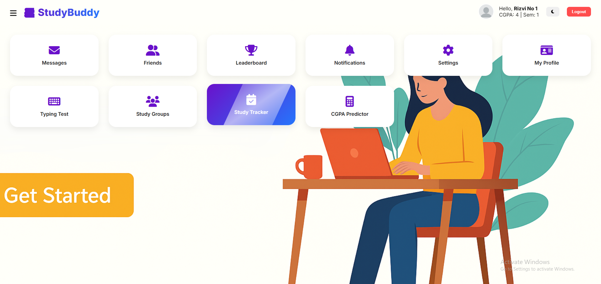
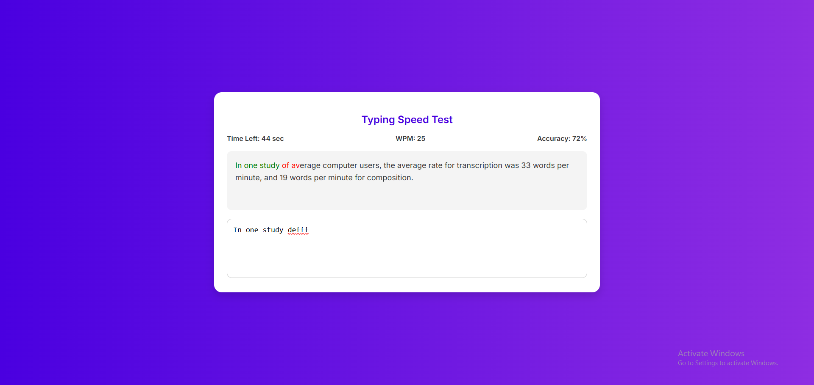
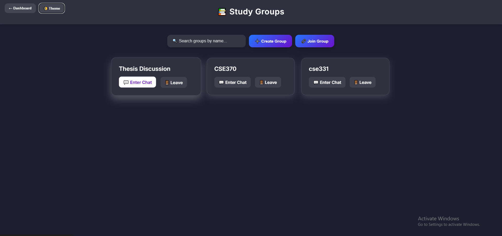
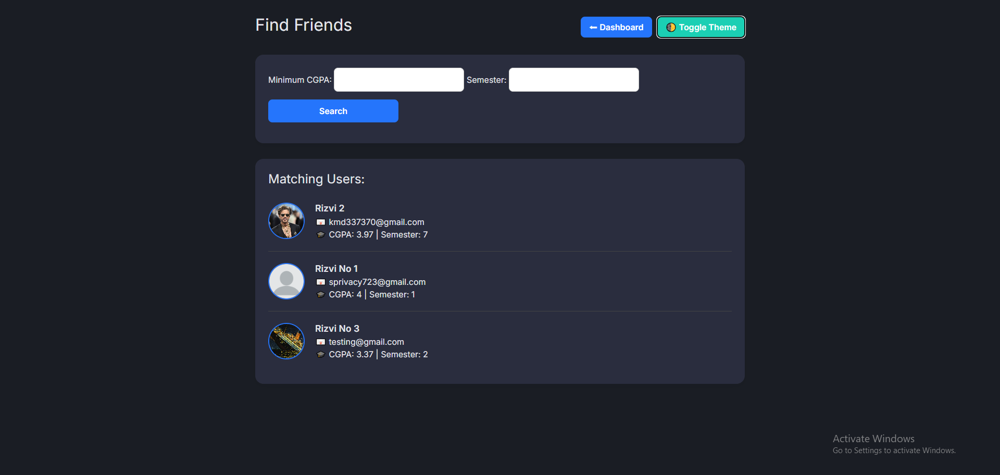

# 📚 StudyBuddy

A sleek, feature-rich web app designed to supercharge students' productivity, collaboration, and focus. Whether you're finding accurate study partners, tracking your study time, chatting with peers, or testing your typing speed — StudyBuddy has it all in one premium experience.

---

## 🚀 Features

✨ **Dashboard Overview**  
A modern UI to navigate all modules with ease.

💬 **Messages**  
Chat privately with friends or discuss inside study groups.

👥 **Friends System**  
Find study partners based on their semester and cgpa to ensure that he/she is exactly the buddy you want to study with.

⌨️ **Typing Test**  
Boost your typing skills with real-time WPM and accuracy tracking.

📚 **Study Groups**  
Create, join, leave, and chat in dedicated study groups.

📅 **Study Tracker**  
Monitor and log your daily focus hours and performance trends.

📈 **CGPA Predictor**  
Predict future CGPAs based on your academic goals.

---

## 🖼️ Preview

> Main Dashboard  

> Typing Test  

> Study Groups Chat  

> Find Friends  

---

## ⚙️ Tech Stack

- 🧠 PHP (Core App Logic)
- 🗃️ MySQL (Database)
- 🎨 HTML + CSS + JS (Frontend)
- 💾 AJAX + JSON (Real-Time Communication)
- 🖼️ Assets & Uploads for Profile Pictures and Custom Data

---
🧾 License
This project is licensed for educational purposes only. Feel free to fork, star, or contribute.

Made with 💜 by Rizvi Iqbal

